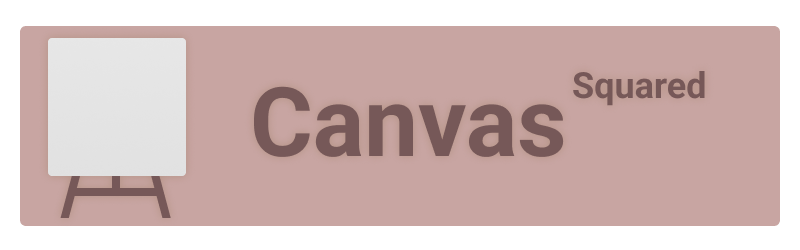

[![Contributors][contributors-shield]][contributors-url]
[![Forks][forks-shield]][forks-url]
[![Stargazers][stars-shield]][stars-url]
[![Issues][issues-shield]][issues-url]
[![MIT License][license-shield]][license-url]

> A super generic web engine. Implemented completely with JavaScript. This project is still in HEAVY development and will likely not work, or be tremendously unstable.

---

# The Four Big Questions!

## What?
CanvasSquared is a generic game engine built using [PixiJS](https://github.com/pixijs/pixijs). It's all web-based, meaning the main systems are running with JavaScript. All systems are built with JSON formatting as well as JavaScript for component coding to your liking. What makes this different from most engines? Unlike other engines out there, CanvasSquared has a low resolution *square* canvas frame. This makes users have the need to adapt their art and designs around the low resolution, ~~quite fun~~!

## When?
When it's ready, this is basically a free time project. I am not sure why you would want to use this. I have no idea how well this is optimized or how well the final product will be.

## Why?
My end goal is to have some sort of web-based engine for some game jams. I just want to make some 2D games. Some would say, "just use *this pre-exisiting engine* it does 2D!!!!1" and to that I say, no, I don't want to, I am petty.

## How?
For the rendering, I do not want to go through the pain of learning WebGL. So, we will be using [PixiJS](https://github.com/pixijs/pixijs)! Why use PixiJS? It was the coolest and most dynamic graphic rendering library I could find.

---

# Other Information

## Licensing
CanvasSquared is using an [CC0](https://creativecommons.org/share-your-work/public-domain/cc0) license. In short, this means you are allowed to modify, sell, and use the code in any way you would like with no liability. One of the big things I believe in is open source projects, and I think this is a resource that should be accessible to anyone.

## Pull Requests
If you do a pull request, all I ask is you provide some information as to why you made the pull request, that's really it. I appreciate anyone's help, especially when it is accessible for everyone else to use!

## Issues / Concerns
If you have any questions, comments, bugs, or concerns, feel free to make an issue request. I am happy to help wherever help is needed, thank you for engaging!

---

###### Hello, World!

[contributors-shield]: https://img.shields.io/github/contributors/HooferDevelops/CanvasSquared.svg?style=flat-square
[contributors-url]: https://github.com/HooferDevelops/CanvasSquared/graphs/contributors
[forks-shield]: https://img.shields.io/github/forks/HooferDevelops/CanvasSquared.svg?style=flat-square
[forks-url]: https://github.com/HooferDevelops/CanvasSquared/network/members
[stars-shield]: https://img.shields.io/github/stars/HooferDevelops/CanvasSquared.svg?style=flat-square
[stars-url]: https://github.com/HooferDevelops/CanvasSquared/stargazers
[issues-shield]: https://img.shields.io/github/issues/HooferDevelops/CanvasSquared.svg?style=flat-square
[issues-url]: https://github.com/HooferDevelops/CanvasSquared/issues
[license-shield]: https://img.shields.io/github/license/HooferDevelops/CanvasSquared.svg?style=flat-square
[license-url]: https://github.com/HooferDevelops/CanvasSquared/blob/master/LICENSE.txt